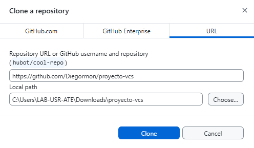

# Calculadora básica con java script
## Clonación del repositorio para github desktop
1. Iniciamos sesión y vamos a la opción "Clone a repository".
   
2. Vamos a la opción de "URL", pegamos el enlace de el repositorio y escogemos una ruta para guardar localmente el repositorio.
   
3. Por ultimo, damos click en clone y tendremos el repositorio clonado en nuestro dispositivo.